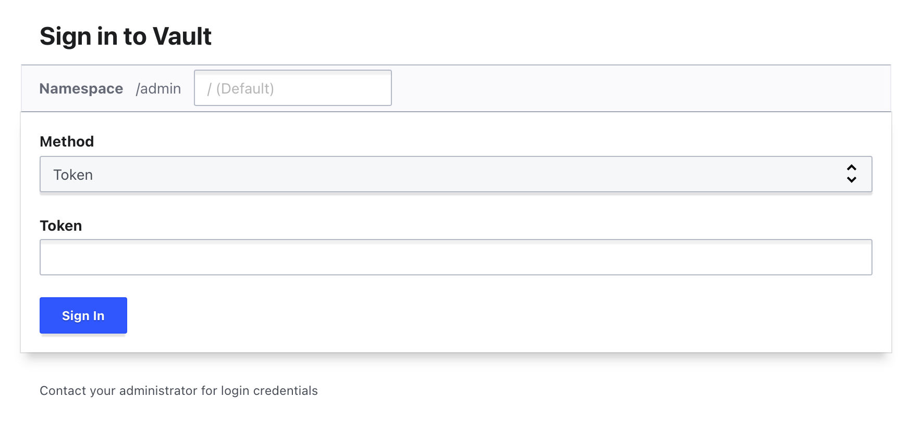

## HashiCorp Cloud Platform

To get you up and running with a development Vault server as easily as possible, we will use HashiCorp Cloud Platform (HCP).

If you do not have an account already, you can sign up for one here:

https://portal.cloud.hashicorp.com/sign-up

Once signed up, you will be prompted to set up your organization. Give it a name, and specify your location.

You will be asked if you want to set up a payment method. You can skip this, as HCP provides you with $50 in credits to get you started, with no commitments.

You will then be presented with the Dashboard

## Deploy a Vault Cluster

In the middle of the dashboard, you will see "Get started with Vault", and a button to "Deploy Vault"

Vault clusters are deployed in their own dedicated HashiCorp Virtual Network (HVN). This enables you to deploy HashiCorp Cloud Products without needing to manage the networking details.

Your HCP Organization will not have an HVN by default, so you will be prompted to create one. You can select the region you would like to use, and the CIDR range for IP addresses in the network.

After a few minutes, your HVN will be ready, and you can click to create a Vault cluster.

You can provide the cluster with a name, or leave it as the default:

HCP will automatically add your cluster to your HVN:

You can select a Vault tier. For this case, we shall use Development, as it's simpler and importantly it's available without needing to provide any payment details:

In the Standard tier there are various sizes available, depending on how much usage you expect.

In the Development tier, you only have one size available:

By default, HCP Vault clusters are not accessible outside your HVN or any peered networks. This is how we recommend running Vault in Production, but to make this demonstration simpler, we will enable public access:

The cluster will now be created. This will take a few minutes, so go make yourself a cup of tea:

## Welcome to Vault

Our Vault cluster is now available

Before you can access it, you will need to generate an Admin token. This is an initial short-lived token which will allow you to administrate your new Vault cluster. With this, you can set up any initial configuration, including new authentication methods.

You can access the Vault UI by clicking the "Public" link, which adds it to your clipboard.

Launch that in your web browser, and you will then be able to log in to Vault using that Admin token

Your initial Vault will be empty, and will look like this in the UI:

