# PKI Secrets Engine

[Secret engines](https://www.vaultproject.io/docs/secrets) are the components of Vault which store, generate or encrypt data. Secrets engines are provided some set of data, they take some action on that data, and they return a result.

The [PKI secrets engine](https://www.vaultproject.io/docs/secrets/pki) generates dynamic X.509 certificates, and is what we will use for this demonstration.

# Terraform Cloud

We will be configuring Vault using [Terraform Cloud](https://www.terraform.io/cloud). Terraform Cloud is a managed service to simplify the provisioning of infrastructure securely and reliably.

If you do not already have a Terraform Cloud account, you can sign up for one here:

https://app.terraform.io/signup/account

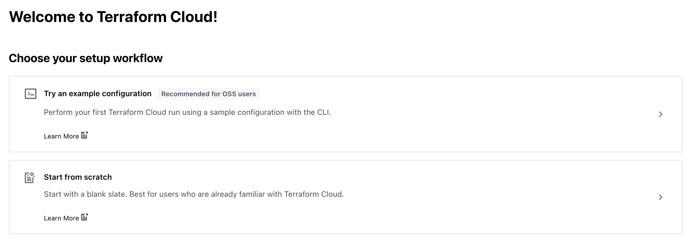

Once signed up, you will be prompted to set up your organization.

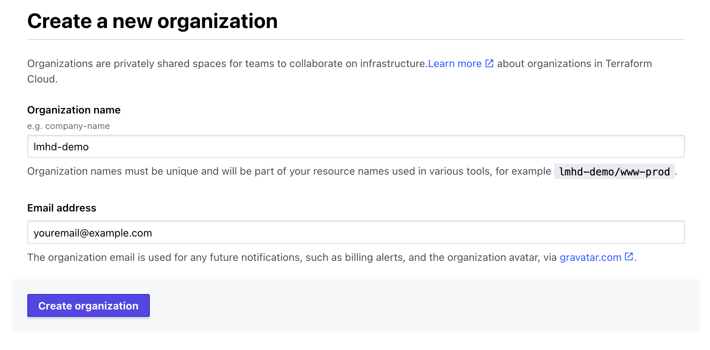

We can create a new Workspace, using the Version Control Workflow

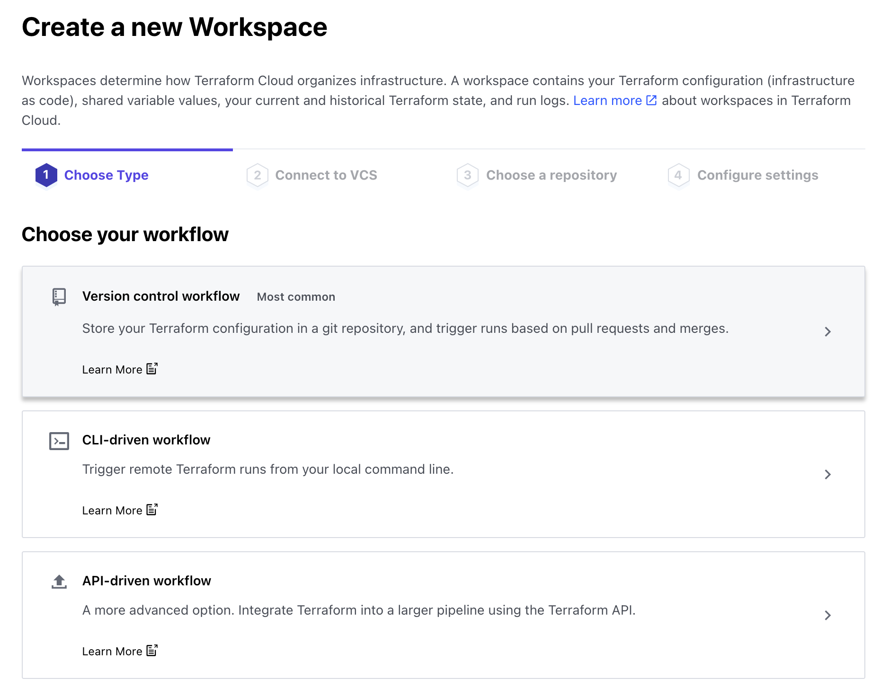

Before we select a version control provider, you should fork [this repo](https://github.com/lucymhdavies/vault-pki-demo) into your own GitHub account.

Select GitHub

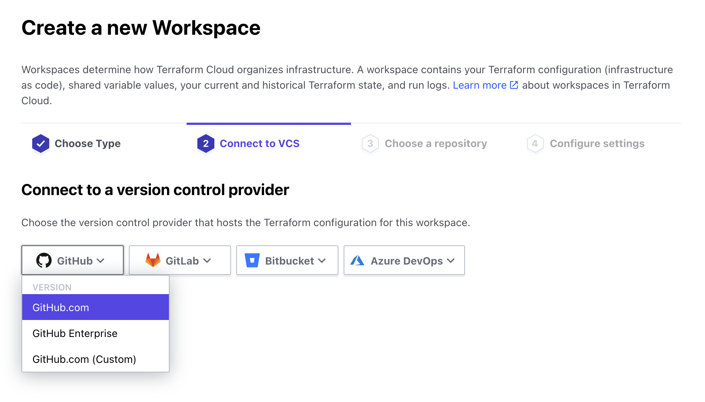

Select your repo from the list

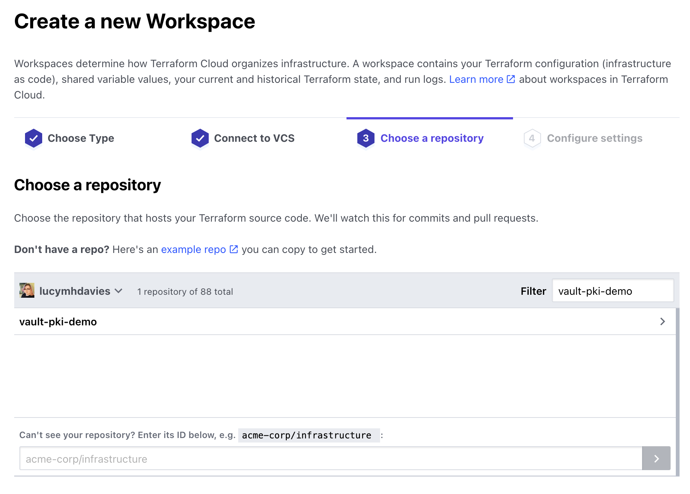

The Terraform code is in the `terraform` directory, so specify that under Advanced Settings, then click "Create workspace"

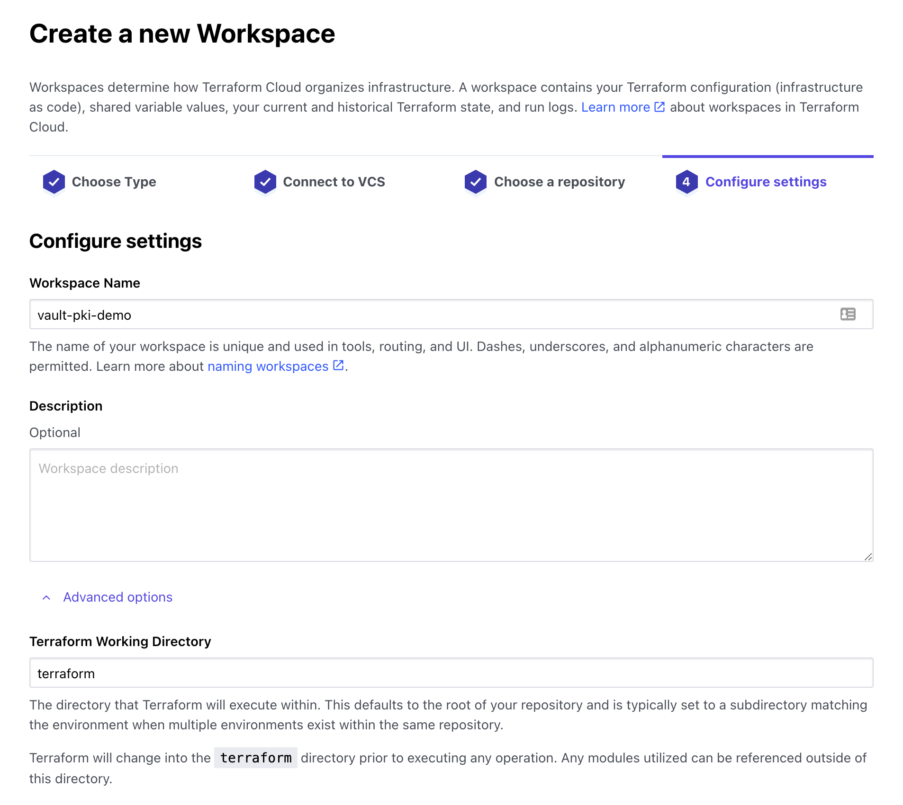

And now we have a Workspace set up:

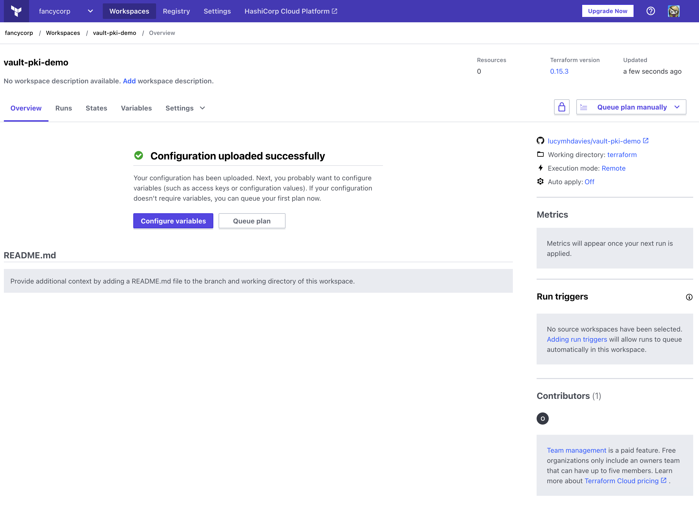

Before we can run Terraform, we need to let Terraform know where to find Vault. We click "Configure variables" to add these as Environment Variables.

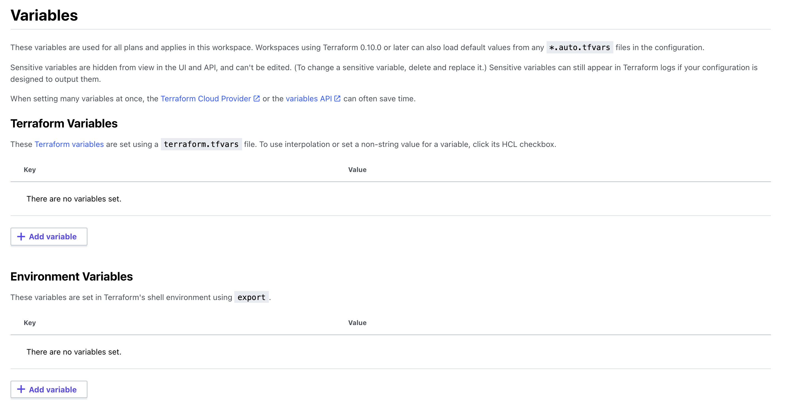

The variables we want to add are:

* VAULT_ADDR - set this to the Public URL you used when [setting up Vault](setup/000_hcp_vault.md)
* VAULT_NAMESPACE - set this to `admin`
* VAULT_TOKEN - generate an Admin token, and set that here. Be sure to mark this one as Sensitive*

In Production, you would use some other Authenication mechanism for this, but we've just got started with a fresh Vault. An example of how to configure Terraform Cloud authentication better is here:

https://lmhd.me/tech/2021/04/07/vaultterraformbootstrap/

You should see something which looks like this:

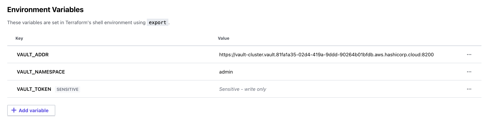

And now we can run Terraform, by clicking "Queue plan manually" in the top right

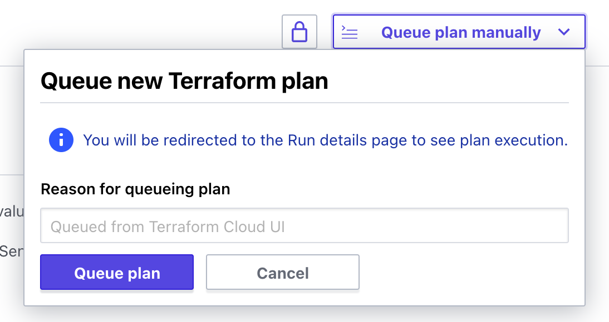

You should see in the output something like this, which confirms that Terraform is ready to configure your Vault cluster with our demonstration configuration

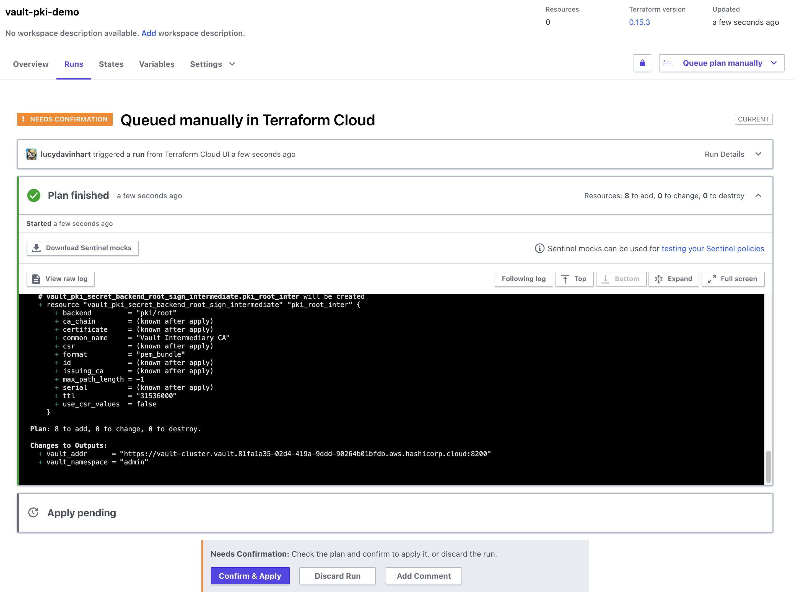

Click "Confirm & Apply", and after a few seconds you should see that the Vault cluster has been configured:

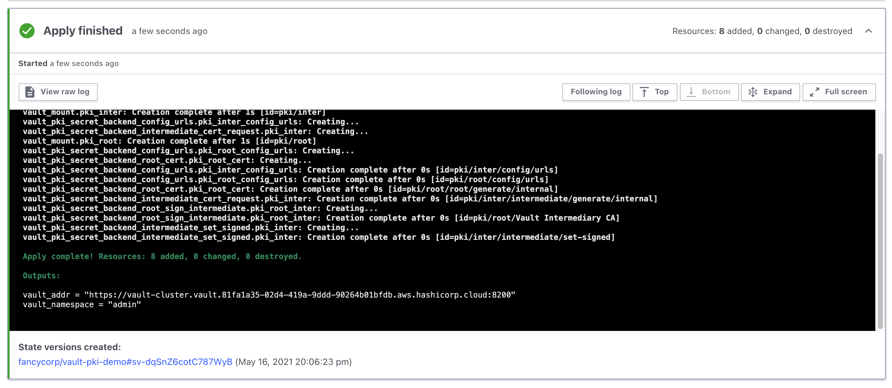

Back in Vault, we should now see that (amongst other things) there are some PKI secret engines configured:

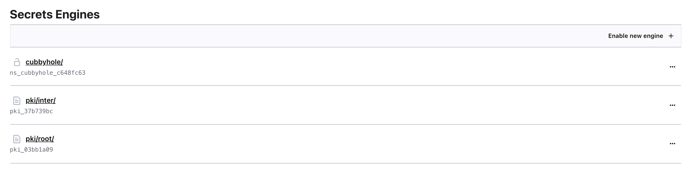